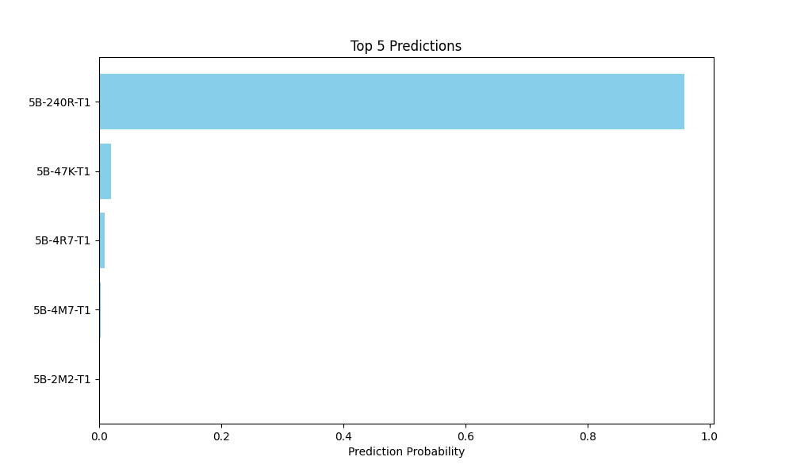

# Machine Learning Based Resistor Classification

This repository includes machine learning-based algorithms to classify 4- and 5-Band resistors.   
The models within this repository are built with TensorFlow (2.16.1) and were trained on a small dataset: [Kaggle Resistor Dataset](https://www.kaggle.com/datasets/barrettotte/resistors). Due to the limited size of the dataset, transfer learning was applied.

## Preprocessing

In order for the models to predict a certain resistor, the images must be preprocessed and resized.  
The preprocessing relies on the following tools:

- [rembg](https://github.com/danielgatis/rembg): For removing image backgrounds.
- A custom-trained YOLOv11n-Segmentation Model: Used for segmentation tasks. Learn more [here](https://docs.ultralytics.com/models/yolo11/).
- [OpenCV](https://github.com/opencv/opencv): For additional image processing.

Below is a representation of the preprocessing pipeline:

## Models

This repository offers multiple models to choose from, with the best model achieving an accuracy of **86.61%**.  
However, there is still room for improvement, and the preprocessing steps might be highly specific to the dataset.

