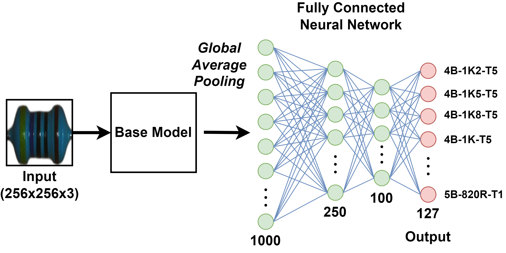

# Machine Learning Based Resistor Classification

     
    <figcaption style="color: gray; font-style: italic;font-size:12px"> Figure 1: <a href="https://neurophysics.ucsd.edu/courses/physics_120/resistorcharts.pdf">Colour Codes</a> to identify THT 4- and 5-band
 resistors </figcaption>

This repository includes machine learning-based algorithms to classify 4- and 5-Band resistors. 
Whilst many existing projects focus on extracting the information of the colour bands and subsequently categorising them using the methodology illustrated in **Figure 1**, the aim of this project is to train a neural network by feeding an RGB image of the resistor body directly to the network.

The models within this repository are built with TensorFlow (2.16.1) and were trained on a small dataset derived from a public [Dataset](https://www.kaggle.com/datasets/barrettotte/resistors). Due to the limited size of the dataset, transfer learning was applied.

## Preprocessing

In order for the models to be able to predict a certain resistance and to enable successful training of the convolutional neural networks proposed in this project, the images are preprocessed (see **Figure 2**).

The preprocessing relies on the following tools:

- [rembg](https://github.com/danielgatis/rembg): For removing image backgrounds.
- A custom-trained [YOLOv11n-Segmentation ](https://docs.ultralytics.com/models/yolo11/) Model: Used for segmentation tasks.
- [OpenCV](https://github.com/opencv/opencv-python): For additional image processing.

    
    <figcaption style="color: gray; font-style: italic; font-size:12px;"> Figure 2: Visualization of the proposed Preprocessing Pipeline (1. Background Removal, 2. Body Segmentation, 3. Detection
 of minimal Bounding Box and 4. Rotation + Resizing)</figcaption>

**Figure 3** shows a comparison of the training performance of two identical models, relying on a [MobileNetV2](https://arxiv.org/pdf/1801.04381) as backbone. 

One model was trained on the original dataset and the other one on a preprocessed dataset. It was observed that the model trained on the original data showed suboptimal convergence, resulting in a final test accuracy of 1.57%, which is only twice the accuracy of random guessing.
However, the model trained on the derived dataset showed a rapid improvement in accuracy, reaching a final test accuracy of 26.77%, which is 16 times better than the model trained on the the original data.

    
    <figcaption style="color: gray; font-style: italic; font-size:12px;">Figure 3: Comparison of Training Performance using
 preprocessed Data vs. original Data</figcaption>

## Models

All models within this repository feature a similiar architectural design depicted in **Figure 4**.

    
    <figcaption style="color: gray; font-style: italic; font-size:12px;">Figure 4: Model Structure (Dropout-Layers not visualized)</figcaption>

The best performing models rely on a [EfficientNetV2-S](http://arxiv.org/pdf/1905.11946v5) or a [ConvNext-Tiny](http://arxiv.org/pdf/2201.03545v2) as base model. 
**Figure 5** shows the training performance of both models. 

    
    <figcaption style="color: gray; font-style: italic; font-size:12px;">Figure 5: Training Performance of both models</figcaption>

Having trained multiple models, the decision was taken to boost their accuracy by combining both models in an ensemble. Furthermore, we experimented with flipping the model's inputs and averaging their outputs.
The best performing model achieves an accuracy of **86.61%**.  

The models avalailable in this repository and their specific performance are listed in **Table 1**.

<table class="tg"><thead>
<caption style="text-align:left;caption-side:bottom;color: gray; font-style: italic; font-size:12px;">Table 1: Models and their Performance</caption>
  <tr>
    <th class="tg-1wig">Model Name</th>
    <th class="tg-1wig">Accuracy</th>
    <th class="tg-1wig">Top-5 Accuracy</th>
  </tr></thead>
<tbody>
  <tr>
    <td class="tg-0lax">MobileNetV2</td>
    <td class="tg-0lax">26.77%</td>
    <td class="tg-0lax">54.33%</td>
  </tr>
  <tr>
    <td class="tg-0lax">ConvNeXtTiny</td>
    <td class="tg-0lax">70.87%</td>
    <td class="tg-0lax">91.34%</td>
  </tr>
  <tr>
    <td class="tg-0lax">ConvNeXtTiny_leftright</td>
    <td class="tg-0lax">74.02%</td>
    <td class="tg-0lax">92.91%</td>
  </tr>
  <tr>
    <td class="tg-0lax">ConvNeXtTiny_updown</td>
    <td class="tg-0lax">74.80%</td>
    <td class="tg-0lax">92.91%</td>
  </tr>
  <tr>
    <td class="tg-0lax">ConvNeXtTiny_averaged</td>
    <td class="tg-0lax">78.74%</td>
    <td class="tg-0lax">92.13%</td>
  </tr>
  <tr>
    <td class="tg-0lax">EfficientNetV2S</td>
    <td class="tg-0lax">77.17%</td>
    <td class="tg-0lax">93.70%</td>
  </tr>
  <tr>
    <td class="tg-0lax">EfficientNetV2S_leftright</td>
    <td class="tg-1wig">81.10%</td>
    <td class="tg-1wig">96.85%</td>
  </tr>
  <tr>
    <td class="tg-0lax">EfficientNetV2S_updown</td>
    <td class="tg-0lax">78.74%</td>
    <td class="tg-0lax">95.28%</td>
  </tr>
  <tr>
    <td class="tg-1wig">EfficientNetV2S_averaged</td>
    <td class="tg-1wig">86.61%</td>
    <td class="tg-1wig">97.64%</td>
  </tr>
  <tr>
    <td class="tg-0lax">Ensemble</td>
    <td class="tg-1wig">84.25%</td>
    <td class="tg-0lax">95.28%</td>
  </tr>
  <tr>
    <td class="tg-0lax">Ensemble_averaged</td>
    <td class="tg-1wig">84.25%</td>
    <td class="tg-1wig">98.43%</td>
  </tr>
</tbody></table>

### Example (1.5kΩ ± 5%)

    
    <figcaption style="color: gray; font-style: italic; font-size:12px;">Figure 6: 4B-1K5-T5</figcaption>

    
    <figcaption style="color: gray; font-style: italic; font-size:12px;">Figure 7: Model Output</figcaption>

